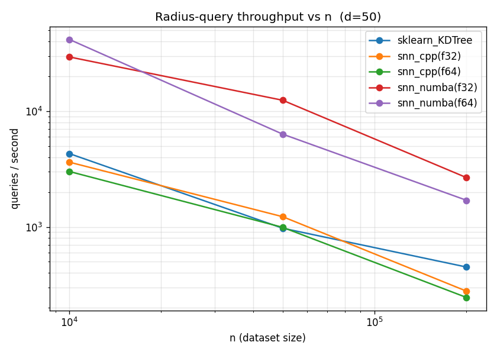
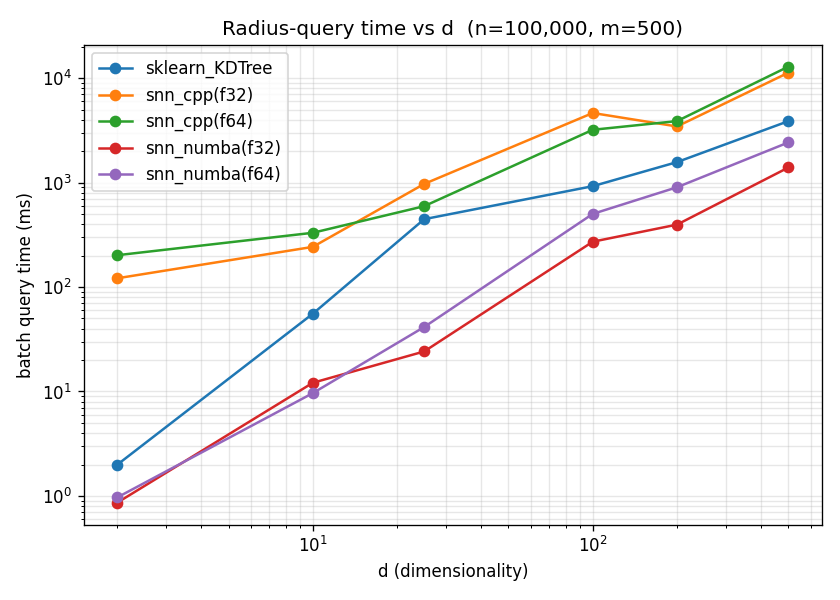

# snn-numba

A pure **Python + Numba** reimplementation of **SNN** — a *fast and exact*
fixed-radius nearest-neighbor search algorithm — with a scikit-learn-style API.

> Chen X, Güttel S. 2024. *Fast and exact fixed-radius neighbor search based on
> sorting.* PeerJ Computer Science 10:e1929.
> <https://doi.org/10.7717/peerj-cs.1929>
>
> Original C++/Python reference: <https://github.com/nla-group/snn>

The original ships a NumPy implementation plus an OpenMP/BLAS C++ extension.
This project re-derives the algorithm in pure Python with Numba-compiled
kernels and, on the benchmarks below, is **~2–10× faster than scikit-learn's
`KDTree`** and **~5–17× faster than the original C++ extension** for batch
radius queries — while returning byte-for-byte identical results in float64.

## How it works

For a fixed radius `r`, we want every point within Euclidean distance `r` of a
query `q`. SNN exploits the fact that projection onto a unit vector `v` is
**1-Lipschitz**:

```
|v·x − v·q| ≤ ‖x − q‖
```

So any neighbor of `q` *must* have its projection within `r` of `q`'s
projection. SNN therefore:

**Index build**
1. Center the data (subtract the column mean).
2. Compute the **first principal component** `v` (via power iteration on the
   centered data — BLAS GEMVs).
3. Project every point onto `v` and **sort** by the projection. Cache the sorted
   projections, the sorted centered rows, their squared norms, and the original
   indices.

**Query** (per query point)
1. Project the query onto `v`.
2. Two **binary searches** locate the contiguous "slab" of points whose
   projection lies in `[v·q − r, v·q + r]` — the only candidates that *can* be
   within the radius.
3. Compute exact squared distances `‖x‖² + ‖q‖² − 2·x·q` for the slab only, and
   keep those `≤ r²`.

Because the slab is a *necessary* condition and the final filter uses exact
Euclidean distance, **the result is exact** (no approximation, no recall loss).

### What Numba does here

The query's hot loop — scanning each slab, computing the fused
`‖x‖²+‖q‖²−2x·q` distance, and applying the radius test — is a single
`@njit(parallel=True, fastmath=True)` kernel (`src/snn_numba/_kernels.py`). It
parallelises across queries with `prange`, has no temporary allocations, and
writes matches straight into pre-sized flat buffers. The index build's linear
algebra (mean, power iteration, projection, sort, norms) stays in NumPy/BLAS,
which is already optimal.

This is also *why it beats the original C++*: the upstream `query_radius_batch`
computes a full `n×m` dense GEMM of all query–point dot products (`O(n·m·d)`,
brute force) and only *then* restricts to the slab. The Numba kernel computes
distances **only inside each pruned slab**, so it does far less work whenever
the radius is selective.

## Installation

This project uses [uv](https://docs.astral.sh/uv/).

```sh
uv sync                 # runtime deps (numpy, numba, scikit-learn, scipy)
uv sync --extra bench   # + benchmarking deps (pandas, matplotlib, pybind11, …)
```

## Usage

The API mirrors `sklearn.neighbors.KDTree`.

```python
import numpy as np
from snn_numba import SNN

rng = np.random.default_rng(0)
X = rng.random((100_000, 100))

# build the index
snn = SNN(X)                      # or SNN(X.astype(np.float32), dtype=np.float32)

# radius query (batch): returns an object array; ind[i] = neighbor indices of X[i]
ind = snn.query_radius(X[:5], r=3.5)

# with distances, sorted nearest-first
ind, dist = snn.query_radius(X[:5], r=3.5, return_distance=True, sort_results=True)

# just the counts (cheapest path — no index materialisation)
counts = snn.query_radius(X[:5], r=3.5, count_only=True)

# per-query radii are supported
ind = snn.query_radius(X[:5], r=np.array([3.0, 3.2, 3.5, 3.5, 4.0]))

# a single 1D point returns a flat index array (like the upstream snnpy)
ind = snn.query_radius(X[0], r=3.5)
```

`SNN.query_radius(X, r, return_distance=False, count_only=False,
sort_results=False)` — see the docstring in `src/snn_numba/snn.py` for full
semantics. Use `dtype=np.float32` for ~2× faster queries at the cost of
occasional float-rounding disagreements exactly on the radius boundary.

## Squidpy integration (Builder extension)

`snn_numba` ships a [squidpy](https://squidpy.readthedocs.io) **Builder class
extension** (per the
[extensibility guide](https://squidpy.readthedocs.io/en/latest/extensibility.html)):
`SNNRadiusBuilder` subclasses squidpy's `GraphBuilderCSR` and builds the generic
**fixed-radius** spatial-neighbor graph with SNN's fast, exact radius search
instead of a KD-tree. A radius graph is exactly what SNN computes, so this is a
natural drop-in.

```python
import squidpy as sq
from snn_numba.squidpy import SNNRadiusBuilder

# plug the builder into squidpy's API
sq.gr.spatial_neighbors_from_builder(adata, SNNRadiusBuilder(radius=50.0))
# -> fills adata.obsp["spatial_connectivities"], adata.obsp["spatial_distances"]
#    and adata.uns["spatial"]

# or the one-line convenience wrapper
from snn_numba.squidpy import spatial_neighbors
spatial_neighbors(adata, radius=50.0)          # set_diag=False by default
spatial_neighbors(adata, radius=50.0, dtype="float32")  # faster, ~exact
```

The builder implements the protocol's only mandatory method,
`build_graph(self, coords) -> (adj, dst)` returning two `csr_matrix` objects
(connectivities and distances), plus the optional `uns_params()`. The graph
construction itself is also exposed squidpy-free as
`snn_numba.snn_radius_graph(coords, radius, set_diag=False)` (returns the same
`(adj, dst)` pair), which is handy for testing or non-squidpy pipelines.

squidpy is an **optional** dependency — install it with:

```sh
uv sync --extra squidpy   # needs a squidpy version exposing the builder API
```

`from snn_numba.squidpy import …` raises a clear `ImportError` if squidpy (with
the builder API) isn't installed; the rest of `snn_numba` has no squidpy
dependency.

## Benchmarks

Hardware: 16 threads (shared machine — expect some run-to-run variance in the
absolute numbers; the *ordering* is stable). Data: Gaussian clusters
(representative of real workloads). Radius auto-tuned to a target average
neighbor count. `m` query points per batch. Times are **milliseconds** (best of
several runs, Numba JIT warmed up); `q/s` = queries per second. Reproduce with
`uv run python bench/run_bench.py`.

### Main scenario — n = 100,000, d = 100, m = 500, ~100 neighbors/query

| method           | build (ms) | query (ms) |   q/s | speedup vs KDTree |
|------------------|-----------:|-----------:|------:|------------------:|
| **snn_numba(f32)** |     610 |    **272** | **1,841** | **3.4×** |
| **snn_numba(f64)** |     621 |    **501** |   **998** | **1.8×** |
| sklearn KDTree   |      2,156 |        923 |   541 | 1.0× |
| snn_cpp(f64)     |      1,595 |      3,201 |   156 | 0.29× |
| snn_cpp(f32)     |      1,275 |      4,634 |   108 | 0.20× |

### Scaling over n (d = 50, m = 500, ~50 neighbors/query) — queries/sec

| n        | snn_numba(f64) | snn_numba(f32) | sklearn KDTree | snn_cpp(f64) |
|----------|---------------:|---------------:|---------------:|-------------:|
| 10,000   |         41,837 |         29,510 |          4,308 |        3,016 |
| 50,000   |          6,342 |         12,454 |            974 |          992 |
| 200,000  |          1,700 |          2,670 |            450 |          245 |

### Scaling over d (n = 100,000, m = 500, ~50 neighbors/query) — queries/sec

| d   | snn_numba(f64) | snn_numba(f32) | sklearn KDTree | snn_cpp(f64) |
|-----|---------------:|---------------:|---------------:|-------------:|
| 2   |        517,270 |        580,694 |        251,639 |        2,481 |
| 10  |         51,842 |         41,273 |          9,010 |        1,513 |
| 25  |         12,066 |         20,685 |          1,120 |          841 |
| 100 |            998¹|          1,841¹|            541¹|          156¹|
| 200 |            554 |          1,263 |            318 |          129 |
| 500 |            206 |            359 |            129 |           39 |

¹ from the main scenario (d = 100).

`snn_numba` leads across the board and its advantage over `KDTree` *grows* with
dimensionality — a single principal-component projection keeps pruning as `d`
rises, whereas KD-trees degrade with the curse of dimensionality.




### Accuracy vs KDTree (ground truth)

SNN is *exact*, so this is a correctness check, not a recall/precision trade-off.

| method         | recall | precision | exact queries |
|----------------|-------:|----------:|--------------:|
| snn_numba(f64) |  1.000 |     1.000 |       500/500 |
| snn_numba(f32) |  1.000 |   0.99998 |       499/500 |
| snn_cpp(f64)   |  1.000 |     1.000 |       500/500 |
| snn_cpp(f32)   |  1.000 |   0.99996 |       498/500 |

float64 reproduces KDTree **exactly**. float32 never misses a true neighbor
(recall = 1.0) and only occasionally includes an extra point sitting essentially
*on* the radius boundary (precision 0.99998). This is verified by the test suite
across many configurations (uniform/clustered, d = 2…100, per-query radii).

## Reproducing

```sh
uv sync --extra bench

# build the original C++ reference extension for comparison (needs g++, OpenMP,
# CBLAS); this also clones nla-group/snn into ./snn_orig if missing:
uv run bash bench/build_cpp.sh

# full benchmark suite -> tables on stdout + CSVs/PNGs in bench/results/
uv run python bench/run_bench.py
```

The benchmarks still run (and skip the C++ rows) if the extension can't be
built.

## Tests

```sh
uv run python -m pytest tests/ -q
```

The suite checks exact agreement with `sklearn.neighbors.KDTree` on uniform and
clustered data, distance correctness/ordering, per-query radii, `count_only`,
single-point queries, float32 tolerance, and input validation.

## Project layout

```
src/snn_numba/
  snn.py         # SNN class: build + query_radius (sklearn-like API)
  _kernels.py    # Numba parallel radius kernels (the hot path)
  _graph.py      # snn_radius_graph: (adj, dst) CSR radius graph (squidpy-free)
  squidpy.py     # SNNRadiusBuilder: squidpy GraphBuilderCSR extension
tests/test_snn.py
tests/test_graph.py            # radius-graph core vs brute force / sklearn
tests/test_squidpy_builder.py  # squidpy integration (skipped if not installed)
bench/
  run_bench.py   # speed + accuracy benchmarks, plots
  common.py      # data generation, radius tuning, timing
  build_cpp.sh   # compile the original C++ snnomp for comparison
  results/       # generated CSVs + PNGs
```

## License

MIT (matching the upstream SNN project). The algorithm is due to Chen & Güttel
(see citation above).
